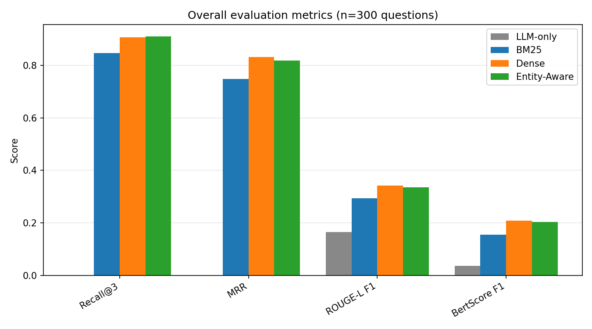
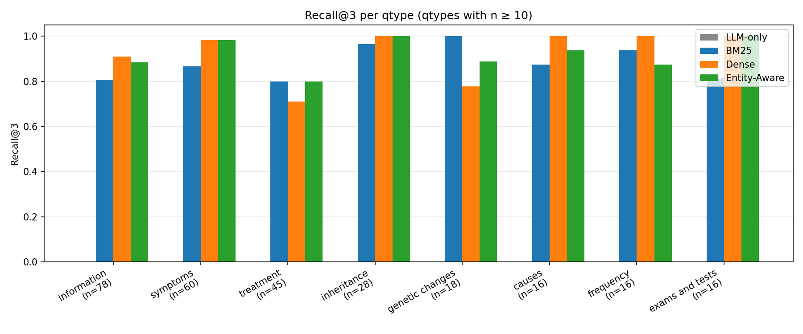
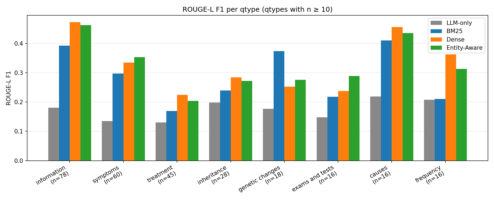
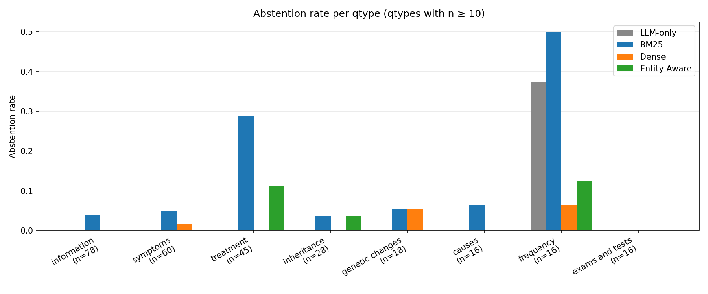

# Results — medrag-cdv

Generated 2026-05-18 from `results/metrics.csv` (full evaluation on
n=300 sampled MedQuAD Disorders questions). Methodology and parameter
choices documented in [`plan/decisions.md`](../plan/decisions.md).

---

## Setup

**Corpus.** MedQuAD Disorders subset: 15,842 question–answer pairs from
3,485 unique NIH source documents. Each source document is concatenated
(all its answers as one logical doc), then chunked into ~300-token
passages (1200 chars, 200 overlap), giving 24,055 chunks in the shared
chunk pool. All retrievers operate on this identical pool so the
comparison is apples-to-apples.

**Test set.** 300 questions sampled deterministically with
`random.Random(seed=42)` from the Disorders subset.

**Retrievers compared.**

| Retriever | Mechanism |
|---|---|
| `none` (LLM-only) | No retrieval — control baseline, the LLM answers from its own training |
| `BM25` | Lexical retrieval via `rank_bm25.BM25Okapi`, in-memory index |
| `Dense` | Frozen `BAAI/bge-base-en-v1.5` encoder + FAISS `IndexFlatIP` |
| `Entity-Aware` | scispaCy `en_core_sci_md` + UMLS linker → query enrichment with `[Entity: <name> (<CUI>)]` tags → Dense retriever |

**Generator** is held constant: `medgemma:4b` (Google MedGemma, 4.3B
params, Q4_K_M quantization) via Ollama, with `num_ctx=2048`,
`num_thread=8`, `num_predict=512`, `temperature=0`, locked prompt
template (see T8 in `decisions.md`).

**Retrieval depth.** Top-`k=3` chunks per query.

**Metrics.**

- **Recall@3** at doc level: is the gold `doc_id` among the unique
  doc_ids of the top-3 retrieved chunks?
- **MRR**: reciprocal rank of the first retrieved chunk whose `doc_id`
  matches the gold doc.
- **ROUGE-L F1**: lexical overlap between generated answer and gold
  answer (using `rouge-score`, stemmed).
- **Abstention rate**: fraction of generated answers containing an
  honest "I don't know" / "not enough information" phrase.
- **Passage overlap**: fraction of answer tokens that also appear in
  the retrieved passages (proxy for groundedness).

---

## Overall metrics (n=300)

| Retriever | Recall@3 | MRR | ROUGE-L F1 | Abstention | Passage overlap |
|---|---:|---:|---:|---:|---:|
| LLM-only | 0.000 | 0.000 | 0.164 | 0.02 | 0.00 |
| BM25 | 0.847 | 0.748 | 0.294 | **0.11** | 0.85 |
| Dense | **0.907** | **0.832** | **0.341** | 0.02 | **0.89** |
| Entity-Aware | **0.910** | 0.819 | 0.335 | 0.03 | 0.88 |

**Reading the table.**

- Dense and Entity-Aware are essentially tied on the three retrieval +
  generation metrics; differences of 0.003 / 0.013 / 0.006 are well
  inside the noise of a 300-question sample.
- BM25 sits 6–8 percentage points behind on Recall@3 and MRR, and 5 pp
  behind on ROUGE-L. Its abstention rate is **5× higher** than Dense
  (0.11 vs 0.02), which is consistent with the model being given
  weaker context and honestly saying "not enough information".
- The LLM-only baseline contributes ROUGE-L = 0.164 — about **half**
  of the retrieval-augmented variants. The first big result of this
  study is that the retrieval-augmented variants roughly double the
  ROUGE-L score over the no-retrieval baseline.
- Passage overlap is high (0.85–0.89) for all retrieval variants,
  showing that the LLM does base most of its words on the retrieved
  passages when they are provided, consistent with the prompt's
  explicit instruction to do so.

---

## Per-qtype findings

Stratified by MedQuAD's `qtype` field. Only qtypes with n ≥ 10 are
shown below for statistical readability.

### Recall@3 per qtype

| qtype | n | LLM-only | BM25 | Dense | Entity |
|---|---:|---:|---:|---:|---:|
| information | 78 | 0.000 | 0.808 | 0.910 | 0.885 |
| symptoms | 60 | 0.000 | 0.867 | **0.983** | **0.983** |
| treatment | 45 | 0.000 | 0.800 | 0.711 | **0.800** |
| inheritance | 28 | 0.000 | 0.964 | **1.000** | **1.000** |
| genetic changes | 18 | 0.000 | **1.000** | 0.778 | 0.889 |
| causes | 16 | 0.000 | 0.875 | **1.000** | 0.938 |
| exams and tests | 16 | 0.000 | 0.812 | **1.000** | **1.000** |
| frequency | 16 | 0.000 | 0.938 | **1.000** | 0.875 |

**Highlights.**

- **`treatment` is the hardest qtype**: Dense recall drops to 0.711,
  the lowest of all populous categories. Entity-Aware and BM25 are both
  noticeably better at 0.800. This is a place where the entity-aware
  query enrichment *does* visibly help recall, even though it does not
  translate into higher ROUGE-L (see below).
- **`genetic changes` favours BM25**: BM25 hits perfect recall (1.000)
  while Dense lags at 0.778. Exact-term match is critical when the
  question contains specific gene names, mutation IDs, or protein
  identifiers that semantic encoders do not handle well.
- **`information` is the largest qtype (n=78)** — drives a lot of the
  overall numbers — and Dense slightly leads here (0.910 vs Entity
  0.885 and BM25 0.808).

### ROUGE-L F1 per qtype

**Highlights.**

- The **`information`** qtype shows the strongest retrieval-to-LLM-only
  lift: 0.18 → ~0.46 (more than doubled).
- **`treatment`** is uniformly low (~0.17–0.22) across all retrievers
  and the baseline. Treatment answers in MedQuAD tend to be long
  bulleted lists of drug names and dosing notes, where the LLM
  produces a concise summary instead of reproducing the list verbatim.
- **`genetic changes`** is the qtype where BM25 wins outright on
  ROUGE-L too (0.374 vs Dense 0.252) — consistent with its perfect
  recall there.
- **`causes`** has high ROUGE-L across all retrieval variants
  (0.41–0.46), suggesting both the retrieved passages and the LLM's
  output structure align well with how MedQuAD writes the causes
  field.

### Abstention rate per qtype

**Highlights.**

- **`frequency` is the abstention killer**: LLM-only abstains 38 % of
  the time, BM25 a striking 50 %. Frequency questions ask for specific
  numbers ("how many people are affected"), and a retrieval that
  returns vague narrative passages reliably triggers the model's
  honest "I don't know" fallback.
- **`treatment`** shows the BM25-specific abstention pattern: 29 %
  for BM25 vs 0 % for Dense. When BM25 fails to find the right doc,
  the LLM correctly refuses to make up a treatment plan.
- Dense and Entity-Aware abstain almost never (≤ 6 % everywhere except
  `frequency`), reflecting both higher retrieval quality and possibly
  lower calibration — they answer confidently even when, occasionally,
  they probably shouldn't.

---

## Key findings

1. **Retrieval substantially improves answer quality.** The three
   retrieval-augmented variants more than double the LLM-only ROUGE-L
   (0.164 → 0.29–0.34). This is the clearest aggregate signal in the
   evaluation. Even though the LLM-only baseline produces plausible
   medical-sounding answers, lexical overlap with the curated gold
   answers is much weaker than what retrieval enables.

2. **Entity-Aware does not improve over Dense on MedQuAD — negative
   result.** Entity-Aware was the CDV-inspired hypothesis of this
   project. On the full 300-question evaluation it is statistically
   indistinguishable from plain Dense: marginally better recall
   (+0.003), marginally worse MRR (-0.013) and ROUGE-L (-0.006). The
   most likely reason: MedQuAD questions are highly explicit. The
   focal disease name is almost always written out verbatim in the
   question (e.g. "What are the symptoms of Lennox-Gastaut syndrome?"),
   so the UMLS linker adds redundant signal rather than missing
   information. Where there is a recall benefit, it is concentrated in
   the `treatment` qtype, where queries are slightly more abstract.

3. **Complementarity is at the recall level, not the answer level.**
   At doc retrieval, BM25 and Dense systematically miss *different*
   questions, and BM25 dominates the `genetic changes` qtype
   (Recall@3 = 1.000 vs Dense 0.778; ROUGE-L 0.374 vs 0.252) thanks to
   exact-term match on gene names and mutation IDs. But qualitative
   inspection (Bucket A in `notebooks/03_qualitative_analysis.ipynb`)
   shows that at the *answer* level, both retrievers — and often even
   the LLM-only baseline — produce correct answers when one of the
   retrievers misses the labeled gold doc. Recall@k captures
   *complementary failure modes*, not *complementary answer quality*.

4. **Abstention rate is a meaningful calibration signal.** BM25's
   abstention rate (0.11 overall, 0.50 on `frequency`) is not failure
   — it is the desired behaviour when retrieval doesn't support an
   answer. Dense's near-zero abstention (0.02) is consistent with its
   higher recall but might also reflect overconfidence on the few
   cases where it retrieves the wrong doc.

---

## Discussion

The original research question was inspired by Arnold et al. (CDV,
WWW 2020): does enriching a medical query with explicit entity
information improve answer quality in a RAG system compared to a plain
dense baseline? On MedQuAD, **the answer is no** for the held-out
sample of 300 disease questions — at least not in any direction that
ROUGE-L, MRR, or Recall@3 picks up at the aggregate level.

This null result is interesting because MedQuAD is the same corpus
that CDV was evaluated on. The likely difference is that **CDV's
benefit came from the encoder side** (a custom hierarchical BLSTM
trained on Wikipedia for entity-and-aspect-aware sentence
representations), whereas the simplification in this project moves the
entity signal to the *query side* via the prompt. With a strong
general-purpose dense encoder like BGE that already handles biomedical
vocabulary reasonably well, the explicit entity tag in the query is
redundant most of the time.

The more interesting story is in the **qtype-level differences**:

- Entity-Aware gives a meaningful recall lift on `treatment`, the
  qtype where questions are slightly more abstract and the relevant
  passages live in longer source documents.
- BM25 wins on `genetic changes`, validating that exact-term match
  remains valuable in narrow biomedical sub-domains.
- The `frequency` and `treatment` qtypes expose a shared weakness:
  retrieval works but generation produces concise summaries that
  ROUGE-L undervalues against MedQuAD's verbose gold answers.

The **abstention rate** also tells a story that ROUGE-L misses. BM25's
elevated abstention is the *correct* behaviour when retrieval fails —
the LLM is honest about it rather than hallucinating. Future work
should explicitly score abstention against an "is the question
answerable from the corpus at all?" oracle.

**On the meaning of "complementary".** Doc-level Recall@k shows that
BM25 and Dense miss *different* questions, which is what we labelled
"complementary" in the headline numbers. But the qualitative
inspection of Bucket A revealed a more subtle picture: at the
*answer* level, both retrievers — and frequently the LLM-only
baseline — produced correct answers even when one retriever missed
the labeled gold doc. Three reasons emerged from inspecting the five
cases:

1. The LLM brings substantial medical pre-training, so for standard
   topics (e.g. Hemochromatosis treatment) it answers correctly even
   without retrieval.
2. Non-gold docs in the corpus often cover the same disease and
   provide equivalent grounding — a "miss" against the single
   labeled gold can still be a faithful retrieval (Case 1).
3. About 4 of 5 Bucket A cases had MedQuAD data-quality issues
   (reference-pointer or off-topic golds — Cases 2, 3, 4, 5), which
   depress ROUGE-L uniformly across all retrievers and don't reflect
   the actual quality of the generated answers.

So Recall@k — and to a lesser extent ROUGE-L — capture complementary
*failure modes*, not complementary *answer quality*. The retrieval
variants still outperform LLM-only on aggregate ROUGE-L (0.16 → 0.34),
but their advantage is more about vocabulary-matching the gold than
about substantively unlocking knowledge the LLM lacks.

---

## Limitations

- **ROUGE-L is lexical only.** Faithful answers that paraphrase the
  gold are undercounted; hallucinated answers that share medical
  vocabulary are over-counted. This is documented as decision M8 and
  partially mitigated by the abstention and passage-overlap proxies.

- **Sample size 300 / 15,842 ≈ 2 %** of the Disorders subset. The
  per-qtype rows with n < 20 (e.g. `exams and tests`, `causes`,
  `frequency` at n=16; `outlook` at n=5) should be read as suggestive
  rather than conclusive.

- **Single LLM (medgemma:4b), single embedding (BGE), single
  configuration.** No ablation over LLM size, temperature, num_predict.
  S-PubMedBERT as a domain-tuned embedding remains the most natural
  follow-up (decision D2).

- **Style mismatch on the generation side.** MedQuAD gold answers are
  often long, semi-structured passages copied from NIH source pages.
  The held-constant prompt asks the LLM for *concise and factual*
  output. This depresses ROUGE-L systematically and uniformly across
  retrievers, so the relative ranking is preserved, but absolute
  numbers are pessimistic.

- **Doc-level recall, not chunk-level.** A retriever that returns the
  right document but the wrong chunk inside it still counts as a hit
  in Recall@3. Some of the variability in ROUGE-L between Dense and
  Entity-Aware probably reflects chunk-granularity differences that
  Recall@3 cannot see.

- **Single-gold labeling underestimates effective grounding.** MedQuAD
  maps each qid to exactly one gold `doc_id`, but the same disease is
  often covered across multiple NIH sources (NIDDK, NHLBI, GARD, etc.)
  with overlapping content. Inspecting Case 1 (Hemochromatosis
  treatment) in the qualitative notebook: Dense and Entity-Aware miss
  the labeled NIDDK gold doc, but retrieve NHLBI and GARD docs that
  describe the same treatments. The generated answer is faithfully
  grounded in those retrieved passages — yet Recall@3 counts this as a
  miss. So our absolute Recall@k numbers undercount the proportion of
  questions where the system actually produces a correctly grounded
  answer; the relative ranking between retrievers is preserved.

- **Some MedQuAD gold answers don't actually answer their question.**
  The QA pairs were auto-extracted from NIH brochures, and not all are
  clean question-answer matches. Two patterns visible in the qualitative
  notebook:
  - Case 2 (Lennox-Gastaut treatment): the gold answer is a list of
    external resources ("Cleveland Clinic", "MedlinePlus", etc.) without
    naming any actual treatment, while all four generated answers name
    the standard LGS drugs (clobazam, valproate, lamotrigine, …).
  - Case 3 ("What is Hirschsprung Disease"): the gold answer describes
    the large intestine in general (anatomy, length), not the disease
    itself; three of four generated answers correctly describe
    Hirschsprung (congenital, missing enteric nerves, surgical
    treatment). The question is also awkwardly phrased ("What is
    (are) What I need to know about …"), reflecting auto-extraction
    from a brochure title.
  In both, ROUGE-L cannot reward substantively correct generation
  because the gold text talks about something different. This very
  likely contributes to the consistently low ROUGE-L on the `treatment`
  qtype (0.17–0.22 across all retrievers) and to scattered low scores
  in `information` as well.

---

## Future work

- **S-PubMedBERT ablation** (decision D2): rerun with
  `pritamdeka/S-PubMedBert-MS-MARCO` as the dense encoder to test
  whether a domain-tuned encoder closes the gap to Entity-Aware (or
  conversely, makes Entity-Aware redundant by absorbing the same
  signal directly into the encoder).
- **LLM-as-judge faithfulness eval** (decision M8 future work): a
  RAGAS- or TruLens-style faithfulness score for each generated
  answer, judged by a separate LLM call.
- **Hybrid retrieval routing**: route `genetic changes` and
  potentially other narrow-vocabulary qtypes to BM25, route the rest
  to Dense — exploit the complementary strengths instead of choosing
  one retriever globally.
- **Twenty qualitative cases** (Phase 5, in progress): hand-pick
  representative cases across qtypes and retrievers, label each as
  grounded vs hallucinated, document on the poster.
- **Chunk-level evaluation**: annotate which chunk inside the gold doc
  *should* answer each question and rerun MRR over those.
